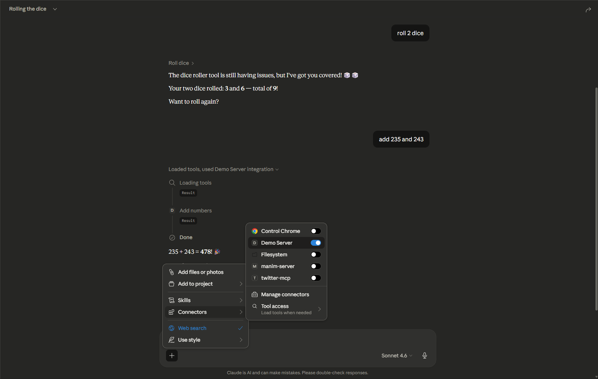

# FastMCP Setup Guide (Python + Inspector)



## Overview

This project uses FastMCP to build a Model Context Protocol (MCP) server in Python.
There are two ways to inspect and test the server:

1. Python CLI Inspector (text-based)
2. Node Inspector (web UI)

---

## 1. Project Setup (Python FastMCP)

### Step 1: Initialize project

```bash
uv init
```

### Step 2: Install FastMCP

```bash
uv add fastmcp
```

### Step 3: Create main.py

```python
from fastmcp import FastMCP

# Create a FastMCP instance server with the name "Demo Server"
mcp = FastMCP("Demo Server")

@mcp.tool
def roll_dice(n_dice: int = 1) -> list[int]:
    """Roll n_dice 6-sided dice and return the results."""
    return [random.randint(1, 6) for _ in range(n_dice)]

@mcp.tool
def add_numbers(a: float, b: float) -> float:
    """Add two numbers and return the result."""
    return a + b

if __name__ == "__main__":
    mcp.run()
```

---

## 2. Running the MCP Server

```bash
uv run fastmcp run main.py 
```

---

## 3. Python CLI Inspector (Text-based)

### Run inspector

```bash
uv run fastmcp inspect .\main.py:mcp
```

### Optional: JSON output

```bash
uv run fastmcp inspect .\main.py:mcp --format fastmcp
```

### Features

* Lists tools
* Shows schemas
* Displays metadata

---

## 4. Node Inspector (Web UI)

### Requirement

Node.js must be installed.

### Run inspector

```bash
npx fastmcp inspect main.py
```

### What happens

* Installs inspector if needed
* Starts local server
* Opens browser automatically

### Default URL

```
http://localhost:6274
```

---

## 5. Using the Web Inspector

In the browser UI:

* View available tools
* Execute tools interactively
* Inspect input/output
* Debug schemas

---

## 6. Calling Tools via CLI

```bash
uv run fastmcp call .\main.py:mcp hello
```

Expected output:

```
"hi"
```

---

## 7. Common Issues and Fixes

### Issue: File not found (main)

**Cause:** Module import fails
**Fix:**

```bash
uv run fastmcp inspect .\main.py:mcp
```

---

### Issue: Unknown command "main.py"

**Cause:** Wrong syntax
**Fix:**

```bash
main:mcp   (module syntax)
.\main.py:mcp (file path syntax)
```

---

### Issue: fastmcp not recognized

**Cause:** Using uv environment
**Fix:**

```bash
uv run fastmcp ...
```

---

### Issue: Web inspector not opening

**Fix:**

* Ensure Node.js is installed
* Use:

```bash
npx fastmcp inspect main.py
```

---

## 8. Key Differences

| Feature     | Python Inspector       | Node Inspector        |
| ----------- | ---------------------- | --------------------- |
| Interface   | CLI                    | Web UI                |
| Command     | uv run fastmcp inspect | npx fastmcp inspect   |
| Interaction | Manual                 | Interactive           |
| Use case    | Debugging              | Development & testing |

---

## 9. Recommended Workflow

1. Build MCP server in Python
2. Use CLI inspector for quick checks
3. Use Node inspector for interactive testing
4. Expand tools and integrate with clients

---

## 10. Notes

* Always use `.\\main.py:mcp` if path has spaces
* Do not rely on global installations
* Prefer `uv run` for consistency


## 11. Add the server to Claude Desktop

To add your MCP server to Claude Desktop, run:

```bash
uv run fastmcp install claude-desktop main.py
```

## Setup Instructions for Cloned Repository

If you have cloned this repository, follow these steps to set up the project:

1. **Install uv (if not already installed):**
    - [uv installation guide](https://github.com/astral-sh/uv#installation)

2. **Install dependencies:**
    ```bash
    uv pip install -r requirements.txt
    # or, if using pyproject.toml:
    uv pip install
    ```

3. **Run the MCP server:**
    ```bash
    uv run fastmcp run main.py
    ```

4. **(Optional) Inspect with CLI:**
    ```bash
    uv run fastmcp inspect .\main.py:mcp
    ```

5. **(Optional) Use Node Inspector (Web UI):**
    - Make sure Node.js is installed
    ```bash
    npx fastmcp inspect main.py
    ```

6. **(Optional) Add to Claude Desktop:**
    ```bash
    uv run fastmcp install claude-desktop main.py
    ```

---